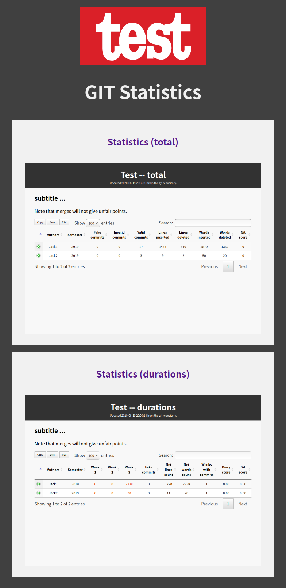
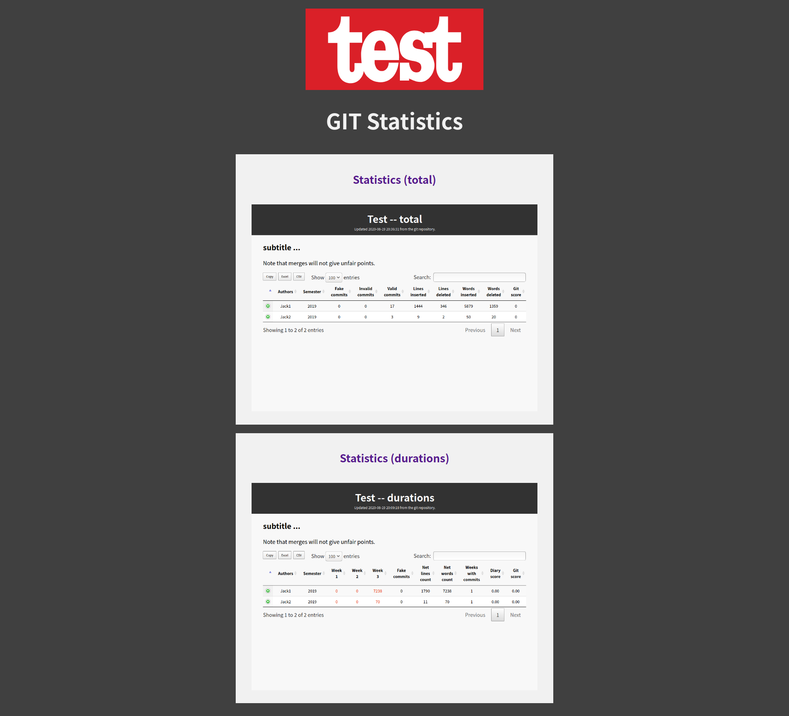
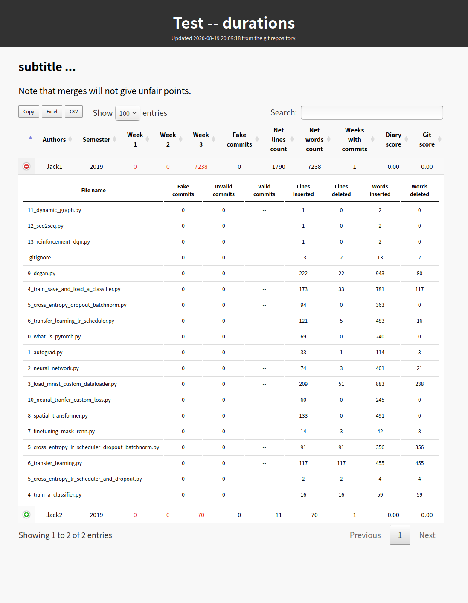

# gitstat
Python package to generate statistics from git.

## Dependencies

* Python3 (>=3.5) (sys, os, json, getpass, shutil, datetime, re, ...)
* Python: [pygit2](https://www.pygit2.org/), [python-dateutil](https://dateutil.readthedocs.io/en/stable/)
* Javascript: [DataTables](https://datatables.net/)

## Features

1. Navigation page (logo, title, multiple links)
   
    Width of screen < 800                |  Width of screen >= 800
    :-----------------------------------:|:-------------------------------------:
      |  

2. Visualization of statistics
   
    * Show statistics in a table
    * Show details of committed file (click the button to expand or collapse)
    * Show whether the auther commits to diary
    * Copy, Export (excel, csv) (By DataTables)
    * Search, Sort, Pagination (By DataTables)
   
    For a long duration             | For multiple durations
    :------------------------------:|:------------------------------------:
      | 
   
3. Generate statistics (Load settings from a json file)

    * Statistics (number of commits, lines inserted, lines deleted, words inserted, words deleted, ...)
    * Details of commits to each file
    * Exclude fake commits (use `"fake commits": ["commit_id1", ...]` to label them manually)
    * Consider specific commits as commits of an author (use `"his commits": ["commit_id1", ...]` to label them manually)
    * Scoring (according to the statistics and file extensions)
    * (only for `"query type": "durations"`) Diary check for every query (use `"diary": ["filepath_1", ...]` to set diary)
        * Whether there is any commit to specifc files
        * Whether there are some strings of date (within the durations) in specific files
   
## Usage

### **To use this tool**

```
git clone https://github.com/jk13o3lll/gitstat.git
pip install python-dateutil, pygit2
```

### **To generate statistics for a long duration**

```
python generate_total.py config_total.json
```

Format of `config_total.json` (Use `"pubkey"` and `"privkey"` to get authentication by ssh key.)

```
{
    "title": "Test -- total",
    "subtitle": "subtitle ...",
    "note": "Note that merges will not give unfair points.",
    "url": "https://github/jk13o3lll/pytorch-learning",
    "clone": "https://github.com/jk13o3lll/pytorch-learning.git", 
    "repository": "/home/jackwang/Repositories/pytorch-learning/.git",
    "pubkey": "/home/jackwang/.ssh/id_rsa.pub",
    "privkey": "/home/jackwang/.ssh/id_rsa",
    "html": "/home/jackwang/Repositories/gitstat/html/index_total.html",
    "export": "pytorch-learning",
    "weights": {
        "number of commits": 0.3, "lines inserted": 0.2, "lines deleted": 0.15, "words insreted": 0.2, "words deleted": 0.15
    },
    "query type": "total",
    "queries":[
        { "name": "Total", "since": "2015-09-08T00:00:00+08:00", "until": "2020-09-14T00:00:00+08:00" }
    ],
    "authors": [
        { "name": "Jack", "emails": ["ccwang.jack@gmail.com"], "labels": ["2019"] },
        { "name": "Others", "emails": ["noreply@github.com"], "labels": ["2019"] }
    ],
    "fake commits": [
        "6ec05deb10728f364"
    ]
}
```

### **To generate statistics for multiple durations**

```
python generate_durations.py config_durations.json
```

Format of `config_total.json` (If there is no `"pubkey"` or `"privkey"`, you will need to use username and password to log in.)

```
{
    "title": "Test -- durations",
    "subtitle": "subtitle ...",
    "note": "Note that merges will not give unfair points.",
    "url": "https://github/jk13o3lll/pytorch-learning",
    "clone": "https://github.com/jk13o3lll/pytorch-learning.git", 
    "repository": "/home/jackwang/Repositories/pytorch-learning/.git",
    "html": "/home/jackwang/Repositories/gitstat/html/index_duration.html",
    "export": "pytorch-learning",
    "weights": {
        "number of commits": 0.3, "lines inserted": 0.2, "lines deleted": 0.15, "words insreted": 0.2, "words deleted": 0.15
    },
    "query type": "durations",
    "queries":[
        { "name": "Week 1", "since": "2017-09-08T00:00:00+08:00", "until": "2018-09-14T00:00:00+08:00" },
        { "name": "Week 2", "since": "2018-09-08T00:00:00+08:00", "until": "2019-09-14T00:00:00+08:00" },
        { "name": "Week 3", "since": "2019-09-08T00:00:00+08:00", "until": "2020-09-14T00:00:00+08:00" }
    ],
    "authors": [
        { "name": "Jack", "emails": ["ccwang.jack@gmail.com"], "labels": ["2019"], "diary": ["Diary/my_diary.md"], "his commits": ["c32932b"] },
        { "name": "Others", "emails": ["noreply@github.com"], "labels": ["2019"], "diary": ["Diary/others_diary.md"] }
    ],
    "fake commits": [
        "6ec05deb10728f364"
    ]
}
```

### **To run this program automatically (for Linux)**

```
// add to crontab
crontab -e

// add the following line in crontab (run at 0:00 and 12:00 every day)
0 0,12 * * * python /aaa/bbb/generate_total.py /xxx/ooo/config_zzz.json >| /ppp/qqq/rrr.log 2>&1
```

## Contact

ccwang.jack@gmail.com
